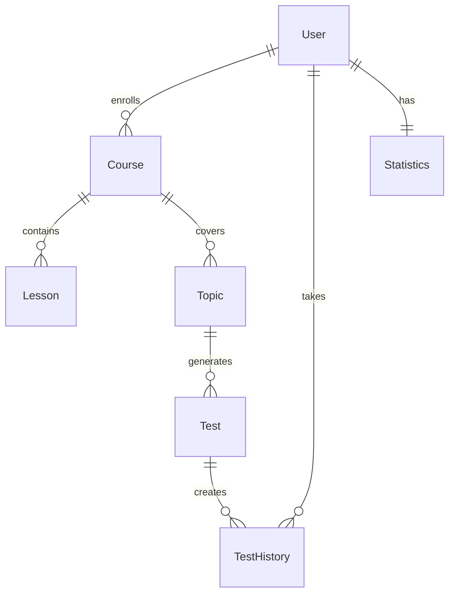

# 🧮 MathGenie

<div align="center">


**Современная образовательная платформа для подготовки к ОРТ и другим экзаменам**

[](https://nodejs.org/)
[](https://www.mongodb.com/)
[](https://expressjs.com/)
[](https://groq.com/)

[📖 Документация](#-документация) • [🚀 Быстрый старт](#-быстрый-старт) • [💡 Функции](#-основные-возможности) • [🤖 ИИ тесты](#-генерация-тестов-с-groq-ai)

</div>

---

## 🌟 О проекте

**MathGenie** — это инновационная образовательная платформа, которая объединяет традиционные методы обучения с современными технологиями искусственного интеллекта. Платформа предназначена для эффективной подготовки студентов к ОРТ и другим важным экзаменам.

### ✨ Почему MathGenie?

- 🎯 **Персонализированное обучение** с адаптивными тестами
- 🤖 **ИИ-powered генерация** контента с помощью Groq
- 📊 **Детальная аналитика** прогресса студентов
- 🎥 **Интерактивные стримы** с живым общением
- 🏆 **Геймификация** процесса обучения

---

## 🚀 Основные возможности

### 🎓 Обучающий модуль
- **Многоуровневые курсы** по различным предметам
- **Система ролей**: администраторы, преподаватели, студенты
- **Live streaming уроки** с интерактивным чатом
- **Умное расписание** с автоматическими напоминаниями
- **Прогрессивная система достижений**

### 🤖 ИИ-тестирование (Powered by Groq)
- ⚡ **Мгновенная генерация тестов** любой сложности
- 🎯 **Адаптивные вопросы** под уровень студента
- 📝 **Подробные объяснения** к каждому ответу
- 🔄 **Динамическое обновление** контента
- 📚 **Интеграция с материалами курсов**

### 📊 Продвинутая аналитика
<details>
<summary>🔍 Детальная статистика для студентов</summary>

- Прогресс по каждому курсу и теме
- Анализ сильных и слабых сторон
- История всех тестов и оценок
- Рекомендации по улучшению
- Сравнение с другими студентами
</details>

<details>
<summary>📈 Инструменты для преподавателей</summary>

- Отчёты по успеваемости группы
- Анализ эффективности материалов
- Статистика посещаемости стримов
- Индивидуальные рекомендации для студентов
</details>

### 🛠️ Административная панель
- **Современный AdminJS интерфейс**
- **Управление пользователями и ролями**
- **Конструктор курсов и уроков**
- **Планировщик расписания**
- **Мониторинг системы**

---

## 🧑‍💻 Быстрый старт

### Предварительные требования
- Node.js 18+
- MongoDB 6.0+
- Groq API ключ

### Установка

```bash
# 1. Клонирование репозитория
git clone https://github.com/your-username/mathgenie.git
cd mathgenie

# 2. Установка зависимостей
npm install

# 3. Настройка окружения
cp .env.example .env
# Заполните необходимые переменные в .env файле

# 4. Запуск в режиме разработки
npm run dev
```

### 🌐 Доступные эндпоинты

| Сервис | URL | Описание |
|--------|-----|----------|
| 🏠 **Главная** | `http://localhost:3000` | Основное приложение |
| 📚 **API Docs** | `http://localhost:3000/docs` | Swagger документация |
| ⚙️ **Admin Panel** | `http://localhost:3000/admin` | Панель администрирования |

---

## 📚 Архитектура системы

### 🏗️ Основные сущности



| Сущность | Описание |
|----------|----------|
| **User** | Пользователи системы (admin, teacher, student) |
| **Course** | Образовательные курсы |
| **Lesson** | Уроки, включая стримы |
| **Schedule** | Расписание занятий |
| **Topic** | Темы для изучения |
| **Test** | ИИ-генерируемые тесты |
| **TestHistory** | История прохождения тестов |
| **Statistics** | Персональная аналитика |

---

## 🤖 Генерация тестов с Groq AI

### API эндпоинты

```http
POST /api/test/generate
Content-Type: application/json

{
  "topic": "Геометрия",
  "difficulty": "intermediate",
  "questionCount": 10
}
```

### Пример сгенерированного вопроса

```json
{
  "questionId": "q1",
  "text": "Чему равна площадь круга с радиусом 5 см?",
  "type": "multiple_choice",
  "options": [
    { "optionId": "a", "text": "25π см²" },
    { "optionId": "b", "text": "10π см²" },
    { "optionId": "c", "text": "5π см²" },
    { "optionId": "d", "text": "15π см²" }
  ],
  "correctAnswer": "a",
  "explanation": "Площадь круга вычисляется по формуле S = πr². При r = 5: S = π × 5² = 25π см²",
  "difficulty": "intermediate",
  "estimatedTime": 60
}
```

### Уровни сложности

| Уровень | Описание | Время на вопрос |
|---------|----------|----------------|
| 🟢 **Beginner** | Базовые концепции | 30-45 сек |
| 🟡 **Intermediate** | Средний уровень | 60-90 сек |
| 🔴 **Advanced** | Сложные задачи | 120+ сек |

---

## 🔒 Система безопасности

### Аутентификация и авторизация
- **JWT токены** для защищённых маршрутов
- **Role-based access control (RBAC)**
- **Безопасное хранение паролей** с bcrypt

### Права доступа

| Роль | Права |
|------|-------|
| 👑 **Admin** | Полный контроль над системой |
| 🎓 **Teacher** | Создание курсов, уроков, тестов |
| 👨‍🎓 **Student** | Прохождение курсов и тестов |

---

## 🛡️ Технологический стек

<div align="center">

| Категория | Технологии |
|-----------|------------|
| **Backend** |   |
| **База данных** |   |
| **ИИ/ML** |  |
| **Документация** |  |
| **Администрирование** |  |
| **Real-time** |  |

</div>

---

## 📊 Статистика и мониторинг

### Dashboard метрики
- 📈 Активность пользователей
- 🎯 Эффективность курсов
- 🤖 Использование ИИ
- 📊 Производительность системы

### Отчёты
- **Ежедневные** сводки активности
- **Недельные** отчёты по прогрессу
- **Месячные** аналитические дашборды

---

## 🚀 Планы развития

- [ ] 🎨 **Мобильное приложение** (React Native)
- [ ] 🌐 **Многоязычность** интерфейса
- [ ] 🎮 **Геймификация** с достижениями
- [ ] 📱 **Push-уведомления**
- [ ] 🔊 **Голосовое управление**
- [ ] 📊 **Расширенная аналитика** с ML
- [ ] 🤝 **Интеграции** с внешними платформами

---

## 📖 Документация

### API Reference
Полная документация API доступна по адресу `/docs` после запуска приложения.

### Guides
- [🔧 Руководство по настройке](docs/setup.md)
- [👨‍🏫 Гид для преподавателей](docs/teacher-guide.md)
- [👨‍🎓 Гид для студентов](docs/student-guide.md)
- [🔌 API интеграция](docs/api-integration.md)

---

## 🤝 Сообщество и поддержка

### Связь с разработчиками
📧 **Email**: asoltobekovv@gmail.com
📷 **Instagram**: [@991o2o9](https://www.instagram.com/991o2o9/)  
💬 **Telegram**: [@mathgenie_support](https://t.me/amin9102)

### Вклад в проект
Мы приветствуем любой вклад в развитие проекта! Пожалуйста, ознакомьтесь с [руководством по контрибуции](CONTRIBUTING.md).

---

## 📄 Лицензия

Этот проект распространяется под лицензией MIT. Подробности в файле [LICENSE](LICENSE).

---

<div align="center">

**Сделано ❤️ от Солтобеков Амин**

⭐ Поставьте звезду, если проект был полезен!

</div>
